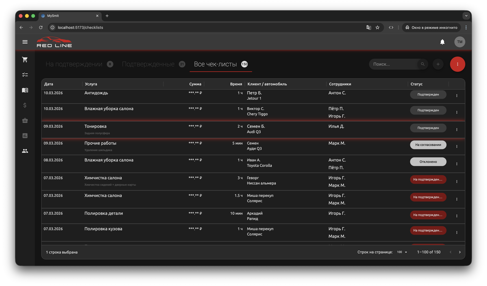
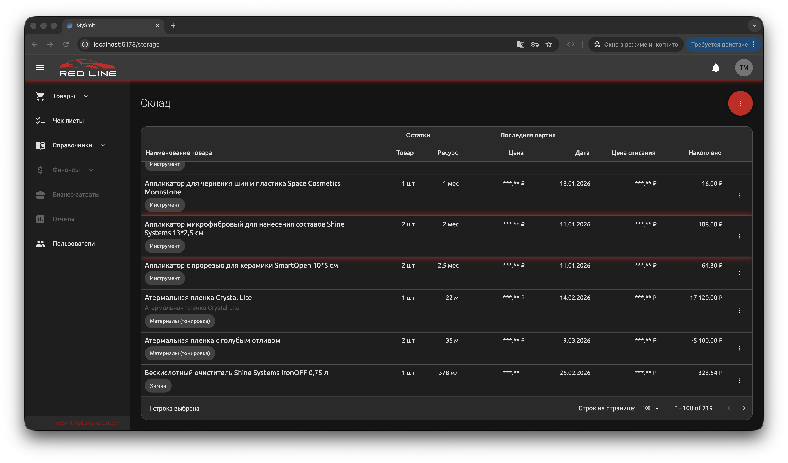
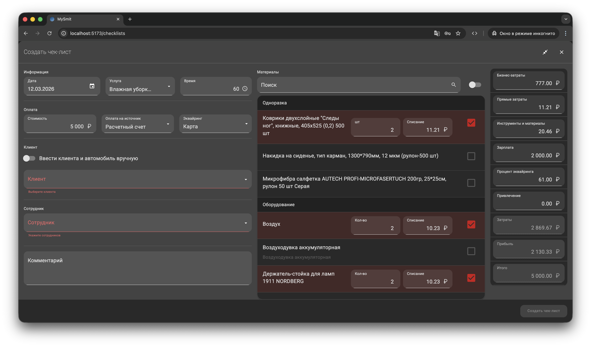
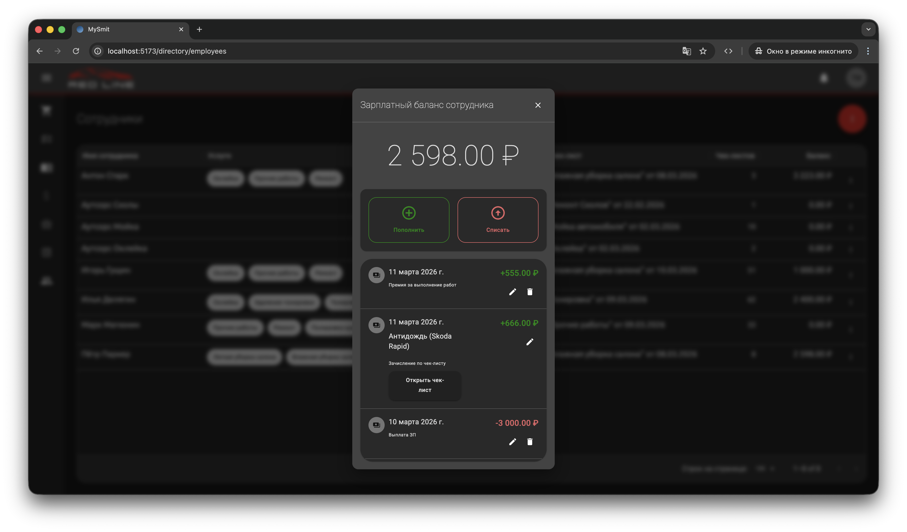
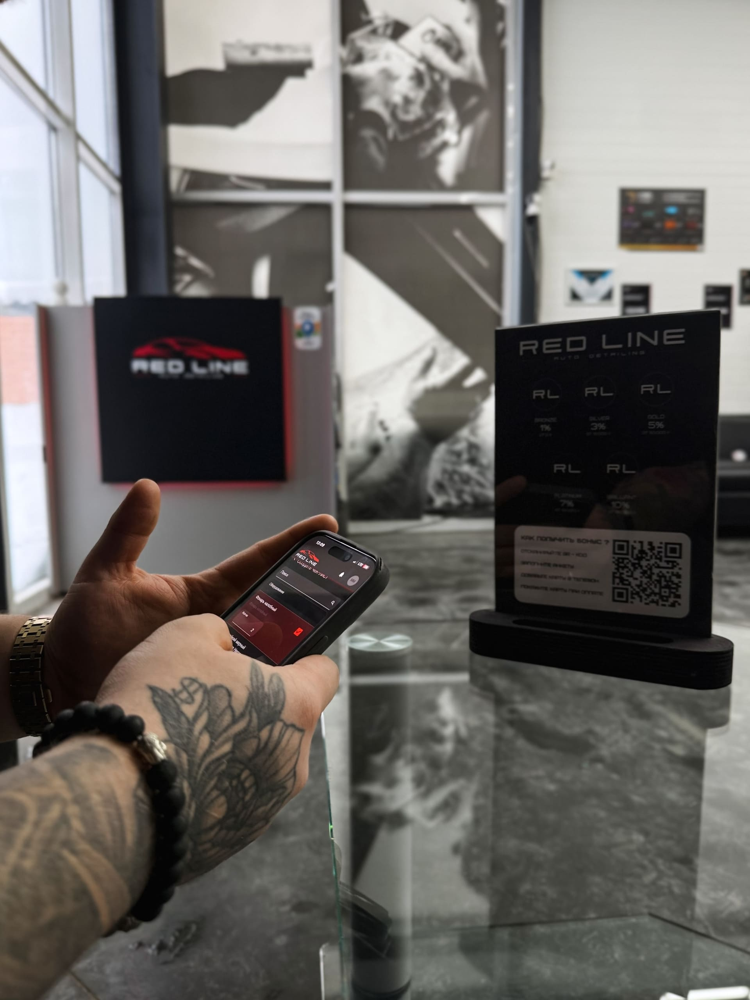

# mySmit

---

**mySmit** — корпоративная система учета и управления для **премиального автодетейлинга RedLine**, г. Тюмень

Цель проекта — предоставление менеджерам и сотрудникам удобного инструмента для контроля всех бизнес-процессов: от создания услуг и чек-листов, до учёта товаров склада, мониторинга выполнения задач и эффективности работы команды

Система ориентирована на **двух типов пользователей**:

**Администраторы и менеджеры** работают на десктопе с полным функционалом:

- модерация услуг;
- контроль чек-листов;
- учёт товаров склада;
- согласование задач;
- мониторинг и управление финансами.

**Сотрудники** используют мобильную версию для быстрого выполнения задач прямо на месте работы

**Согласно NDA RedLine**:

- интерфейсы финансового учета **не демонстрируются**
- персональные данные сотрудников и клиентов **скрыты**

Система построена вокруг **workflow согласования**:

1. Сотрудник создаёт чек-лист услуги
2. Старший сотрудник проверяет и подтверждает корректность заполненных данных
3. Менеджер утверждает завершение задачи и фиксирует эффективность

Таким образом, каждый шаг прозрачен, а управление процессами становится прозрачным, контролируемым и предсказуемым

---

## Стек технологий

  
  
  
  
  
  
  
  
  
  
  

---

## Задачи проекта:

Реализация **front-end** с использованием **React + TypeScript + Redux Toolkit + MUI + FSD**

- проектирование UX и UI для десктоп и мобильного иинтерфейса
- реализацию workflow и логики жизненного цикла чек-листов
- интеграцию с API
- адаптацию интерфейса под мобильные устройства и десктоп

Реализация **back-end** с использованием **Node.js + Prisma + PostgreSQL**

- разработка серверной логики системы
- проектирование API для взаимодействия с клиентским приложением
- обработка данных чек-листов услуг, складских товаров (количество, накопленный и остаточный ресурс, накладные), финансов
- обеспечение корректного взаимодействия между ролями пользователей (сотрудник / старший сотрудник / менеджер / администратор)

---

## Методология FSD в mySmit

В проекте архитектура построена по принципам Feature-Sliced Design, что позволило:

- Организовать код в виде независимых слоёв и фич
- Изолировать бизнес-логику от UI-компонентов
- Упростить масштабирование системы при добавлении новых модулей (финансы, склад, роли пользователей)
- Минимизировать связанность между частями приложения
- Обеспечить предсказуемую структуру при работе с большим количеством бизнес-процессов и ролей

FSD была выбрана как архитектурное решение для долгосрочного развития продукта и поддержки сложного workflow с несколькими ролями пользователей.

---

## Демонстрация

### Чек-листы

### Склад

### Создание чек-листа

### Зарплатный баланс сотрудника

---

## Демонстрация использования системы сотрудниками

---

## Основные возможности

- Управление услугами и товарами: создание, редактирование, отслеживание услуг и учет товаров компании
- Чек-листы и workflow согласования: прозрачный контроль выполнения задач
- Мобильный и десктоп интерфейс: сотрудники работают на месте, менеджеры управляют процессами
- Настраиваемый UX/UI: удобство и скорость работы для каждого пользователя
- Мониторинг эффективности: контроль визуальных показателей выполненных задач и прогресса команды
- Финансовый менеджемент: оценка эффективности, управление финансами, анализ рентабельности
- Отчетность: формирование аналитических отчетов и визуализация ключевых показателей
